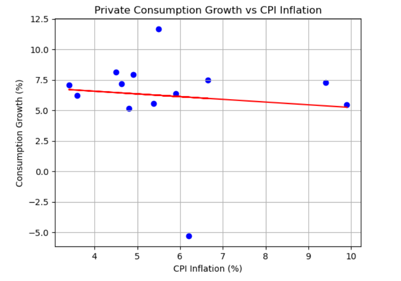

# Inflation-vs-consumption-growth-in-India
This project regresses Private Final Consumption Expenditure against CPI All India General Index Combined in order to determine the determine the effect of inflation of consumption growth.

This project uses the old CPI All India Combined General Index (Base Year 2012) as the independent variable. Private Final Consumption Expenditure 
(Base Year 2011-12) has been used as a dependent vraible. The data for CPI general Index is available from january 2011. Thus, there are 13 observations of both variables from 2012-13 to 2024-25. 

The regression results indicate that higher CPI inflation is associated with a slightly lower real private consumption growth in India. However, the coefficient is not statistically significant at conventional levels (t = -0.382), suggesting weak evidence of a linear relationship in this specification. Given the small dataset (2013–14 to 2024–25), this result should be interpreted cautiously.
